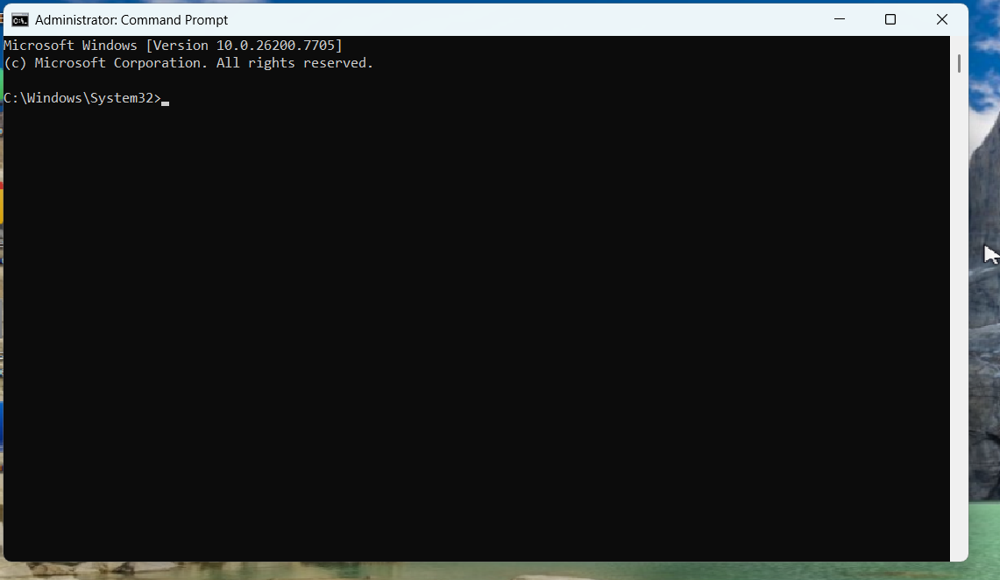
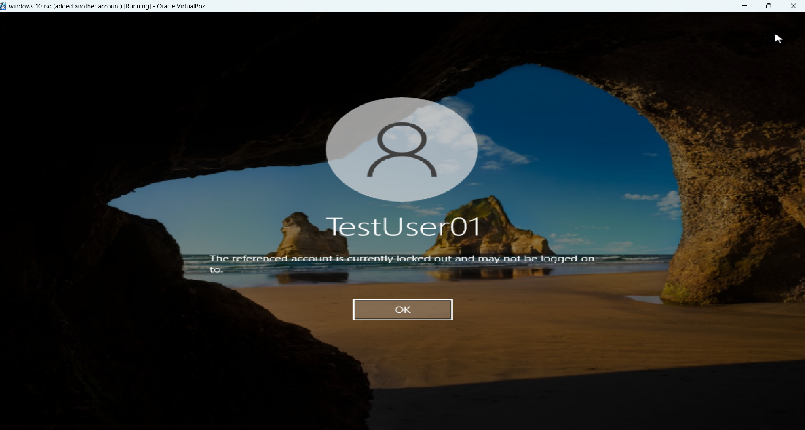
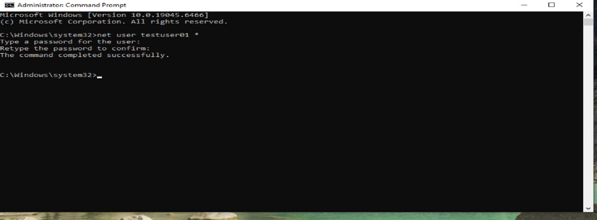
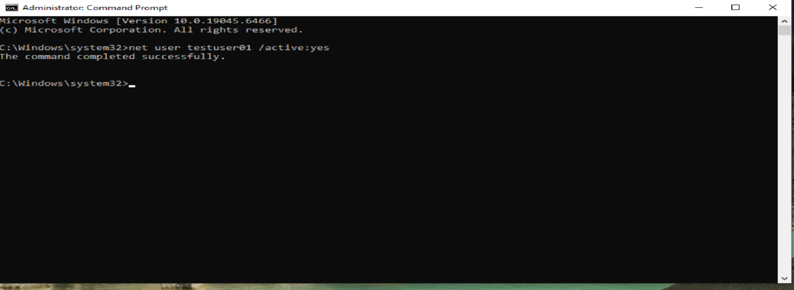
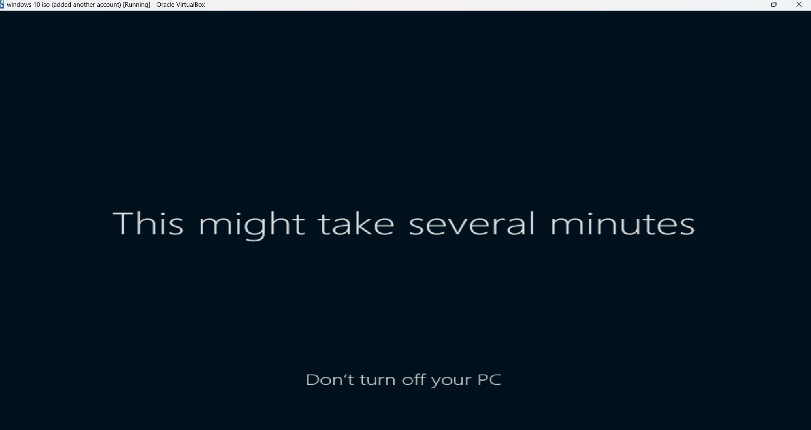

# Lab 01: Account Lockout & Password Reset

## Objective
To simulate a common IT support scenario involving a locked user account and demonstrate the process of resetting a password and restoring access.

## Tools Used
- Windows 10
- Computer Management
- Local Users and Groups
- Command Prompt
- Administrative privileges

## Scenario
A user is unable to log into their workstation due to multiple failed login attempts. The account becomes locked and requires administrative intervention to restore access.

## Steps Performed

1. Simulated multiple failed login attempts to trigger account lockout.
2. Logged into the system using a local administrator account.
3. Opened **Computer Management**.
4. Navigated to **Local Users and Groups → Users**.
5. Located the locked user account.
6. Reset the user’s password.
7. Unlocked the user account.
8. Verified successful login.

## Screenshots

### Account Locked

### Computer Management Access

### Password Reset

### Account Unlocked

### Successful Login

## Skills Demonstrated
- User account troubleshooting
- Password reset procedures
- Windows account management
- Help desk problem-solving
- Basic system administration

## Conclusion
This lab demonstrates the ability to diagnose and resolve a common user access issue, a core responsibility in IT support roles.
