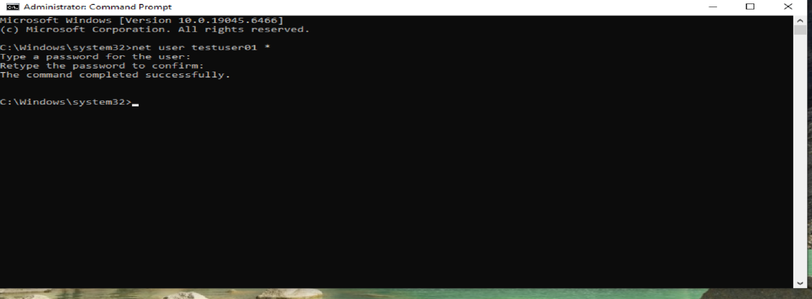

# Lab 01 – Password Reset & Account Lockout

## Objective
Demonstrate the ability to reset a user password and unlock a locked account in a Windows environment, simulating a common IT Support help desk scenario.

## Tools Used
- Windows 10
- Computer Management
- Local Users and Groups
- Administrative privileges

## Scenario
A user reports they are unable to log into their workstation due to multiple failed login attempts. The account is locked and requires a password reset.

## Tasks Performed
- Simulated multiple failed login attempts on a standard user account
- Logged in using a local administrator account to investigate the issue.
- Created and managed a local standard user account using administrative command-line tools due to OS limitations.
- Confirmed the account required administrative intervention before access could be restored.
- Reset user password.
- Unlocked the user account.
- Verified successful login.
- Documented steps and results.

## Outcome
Successfully restored user access by unlocking the account and resetting the password following standard IT support procedures.

## Skills Demonstrated
- User account management
- Password reset and account recovery
- Troubleshooting authentication issues
- Documentation and communication

## Screenshots

### Screenshot 1 – Administrator Command Prompt Open

### Screenshot 2 – User Account Locked

### Screenshot 3 – Password Reset Successful

# Lab 01 - Password Reset & Account Lockout
