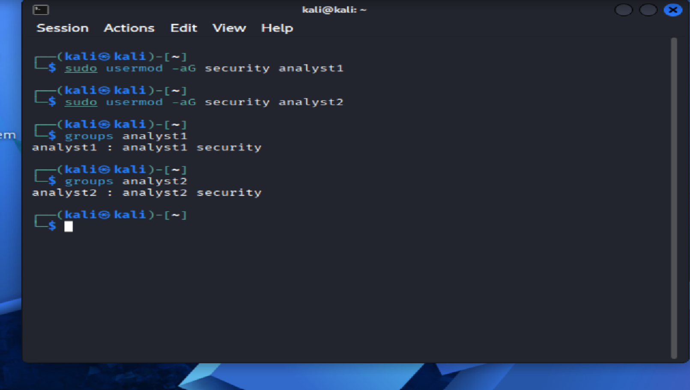
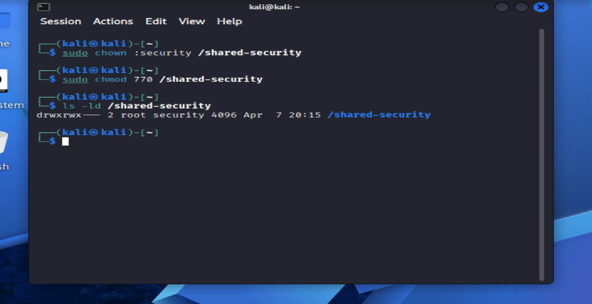
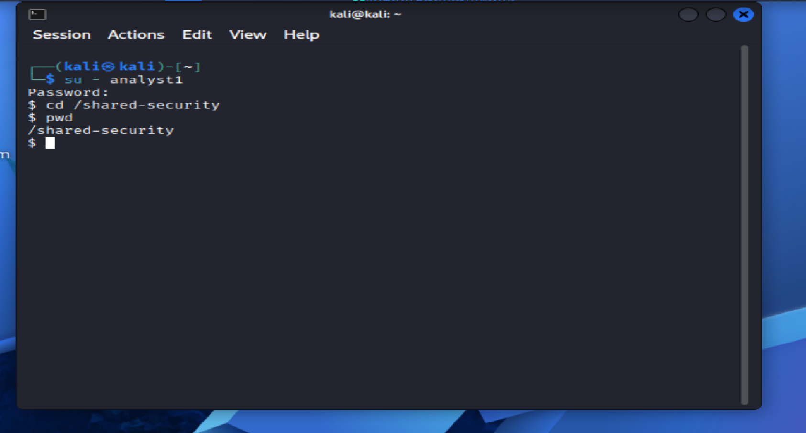

🧾 Lab 02: User & Group Management

🎯 Objective

Simulate a real-world IT support scenario involving user account creation, group management, and permission assignment to control access to system resources.

### 🛠 Tools Used
- Linux (Kali)
- Terminal (Bash)
- File system permissions (chmod, chown)
- User and group management commands

📘 Scenario

An organization requires multiple users to be created and assigned to specific groups with controlled access to shared resources. The IT Support technician must configure users, groups, and permissions while ensuring proper access control.

### 🔧 Steps Performed

1. Created users using command-line tools
2. Set user passwords
3. Created a group for access control
4. Added users to the group
5. Created a shared directory
6. Configured permissions using chmod/chown
7. Verified access using test scenarios\

📸 Screenshots
👤 Users Created

🔐 Passwords Set

👥 Group Created

➕ Users Added to Group

📁 Directory Created

🔑 Permissions Set

✅ Access Test

💡 Skills Demonstrated
User account management
Group-based access control
File system permissions
Troubleshooting access issues
IT support workflow execution
🧠 Conclusion

This lab demonstrates practical experience in managing Linux users and groups, configuring file system permissions, and enforcing access control — core responsibilities in IT support and system administration roles.

### 📸 Screenshots

> Screenshots demonstrate successful execution and validation of each step.

#### 👤 Users Created

#### 👥 Users Added to Group

#### 🔐 Permissions Configured

#### 🧪 Access Test Successful

## 🛠 Troubleshooting

- Encountered user/group configuration issues and resolved using command-line tools  
- Used `groups` to verify group membership  
- Used `ls -ld` to confirm directory permissions and ownership  