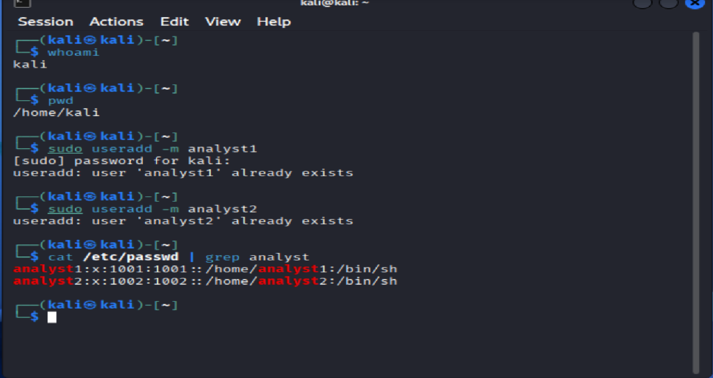

# Lab 02 – User Creation & Group Permissions (Linux)

## Objective
Demonstrate the ability to create and manage Linux users and groups, assign permissions to directories, and enforce least-privilege access. This lab simulates common IT Support tasks related to user onboarding, access control, and permissions management.

---

## Tools Used
- Kali Linux (Virtual Machine)
- Bash Terminal
- Administrative (sudo) privileges

---

## Scenario
An IT Support technician is tasked with onboarding new team members for a security operations team. Users must be created, assigned to a group, and granted access to a shared directory while preventing unauthorized access from other users.

---

## Tasks Performed

### 1. Created New Users
- Created local user accounts `analyst1`, `analyst2` using administrative privileges.
- Assigned secure passwords to each account.

### 2. Created a Security Group
- Created a group ('security') to represent the security operations team
- Verified group creation using system commands.

### 3. Added Users to the Group
- Added users to the 'security' group.
- Verified group membership using the 'groups' command.

### 4. Created a Secure Directory
- Created a shared directory '/shared-security'for team use.
- Assigned group ownership to 'security.

### 5. Configured Permissions
- Applied '770'permissions to restrict access to authorized users only.
- Ensured least- privilege access control.

### 6. Verified Access Control
- Tested file creation as an authorized user.
- Confirmed access denial for unauthorized users.

---

## Commands Used (Examples)
```bash
sudo useradd analyst1
sudo useradd analyst2
sudo passwd analyst1
sudo passwd analyst2

sudo groupadd security
sudo usermod -aG security analyst1
sudo usermod -aG security analyst2

sudo mkdir /shared-security
sudo chown :security /shared-security
sudo chmod 770 /shared-security

## Key Takeaways

- Learned how to create and manage Linux users and groups.
- Applied least privilege access control using chmod and chown.
- Practiced verifying permissions through real testing.
- Gained hands-on experience with user and access management in a Linux environment.

## Resume Bullet

- Created and managed Linux user accounts and groups, implemented role-based access control, and configured secure directory permissions following least privilege principles.

## Screenshots

> Screenshots demonstrate successful execution and validation of each step.

### Users Created


### Group Membership Verified


### Permissions Configured


### Unauthorized Access Denied


## 🛠️ Troubleshooting

- Encountered existing user/group errors and verified using system files
- Used `groups` and `ls -ld` to confirm permissions and ownership